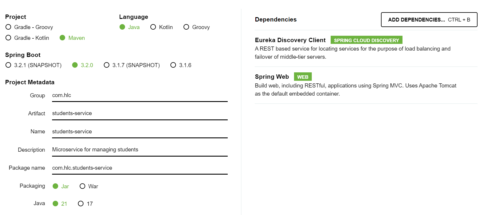
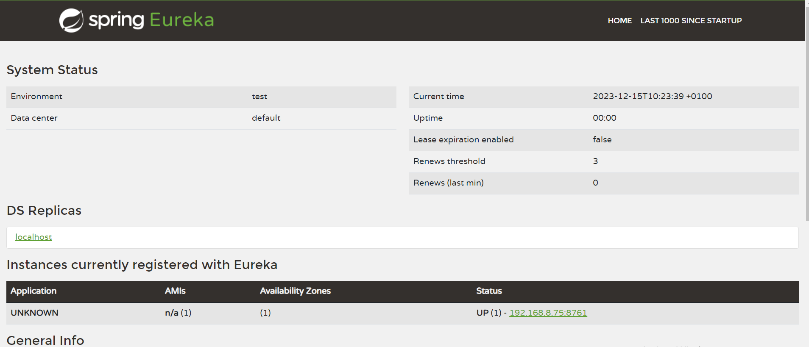
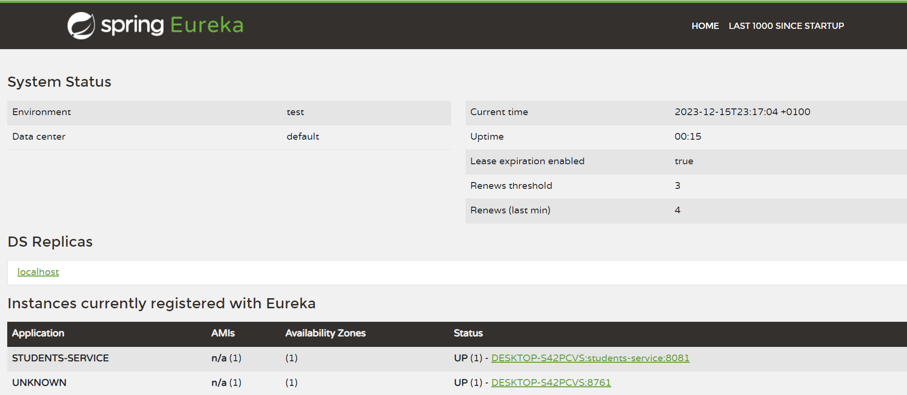
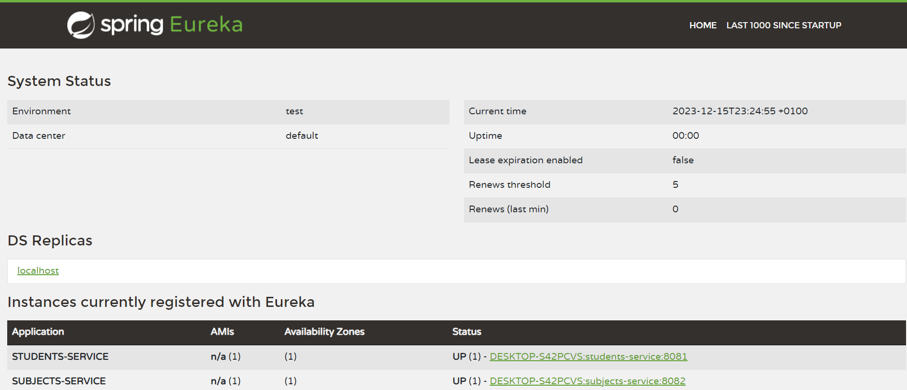
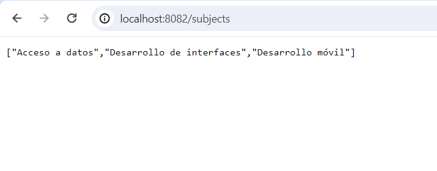
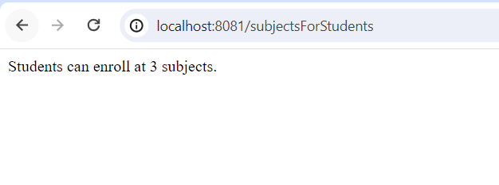

## HLC_P2

En esta práctica vamos a realizar un ejemplo sencillo de arquitectura de microservicios. Para ello, vamos a crear tres microservicios sencillos:

- students-service: Microservicio que gestionará los estudiantes de nuestra plataforma. Un estudiante tiene una o varias asignaturas.
- subjects-service: Microservicio que gestiona las asignaturas.
- discovery-service: Este microservicio registrará al resto de microservicios y las comunicaciones entre ellos.

📌 Para la realización de esta práctica, utiliza ramas en este repositorio. Puedes usar tantas ramas como creas conveniente. Realiza tantos commits como veas necesario. También puedes utilizar PR o cualquier elemento de Git/GitHub.

### Creación de discovery-service

Para crear los microservicios vamos a usar el Spring Initializr. Esta aplicación permite generar proyectos Spring de forma muy rápida, seleccionando directamente las dependencias necesarias para el proyecto.

1. Entramos en https://start.spring.io/
2. Rellenamos la configuración de la siguiente forma:


Es necesario añadir la dependencia Eureka Server porque el discovery-service va a ser nuestro microservicio de descubrimiento.

3. Pulsamos Generate.
4. Incluimos los ficheros en el proyecto.

### Creación de students-service


1. Entramos en https://start.spring.io/
2. Rellenamos la configuración de la siguiente forma:



Es necesario incluir la dependencia Eureka Discovery Client porque queremos que se registre en Eureka, y la de Spring Web porque va a exponer una API.

3. Pulsamos Generate.
4. Incluimos los ficheros en el proyecto.

### Configuración de discovery-service

1. En el fichero src/main/resources/application.properties añadimos las siguientes líneas:

- `spring.config.import=optional:configserver:` para indicar que no vamos a tener un servidor de configuración centralizada.
- `server.port=8761` para indicar que la aplicación se inicie en el puerto 8761 (el puerto por defecto es el 8080). El puerto 8761 es el puerto por defecto en el que los clientes buscan a Eureka. Si nuestro servicio de descubrimiento estuviera en otro puerto, habría que indicárselo a los clientes mediante configuración.

2. Añadimos la anotación @EnableEurekaServer en la clase principal para indicarle al servicio que será un servicio de registro:

```
package com.hlc.discoveryservice;

import org.springframework.boot.SpringApplication;
import org.springframework.boot.autoconfigure.SpringBootApplication;
import org.springframework.cloud.netflix.eureka.server.EnableEurekaServer;

@SpringBootApplication
@EnableEurekaServer
public class DiscoveryServiceApplication {

	public static void main(String[] args) {
		SpringApplication.run(DiscoveryServiceApplication.class, args);
	}

}
```
3. Iniciamos la aplicación y abrimos http://localhost:8761/ para comprobar que se muestra la página de Eureka:



### Configuración de students-service

1. En el fichero src/main/resources/application.properties añadimos las siguientes línea:

- `spring.config.import=optional:configserver:` para indicar que no vamos a tener un servidor de configuración centralizada.
- `server.port=8081` para indicar que la aplicación se inicie en el puerto 8081.
- `spring.application.name=students-service` para indicar el nombre con el que queremos que el microservicio se registre en Eureka.

2. Añadimos la anotación @EnableDiscoveryClient en la clase principal para indicarle al servicio que se registrará en Eureka:

```
package com.hlc.studentsservice;

import org.springframework.boot.SpringApplication;
import org.springframework.boot.autoconfigure.SpringBootApplication;
import org.springframework.cloud.client.discovery.EnableDiscoveryClient;

@SpringBootApplication
@EnableDiscoveryClient
public class StudentsServiceApplication {

	public static void main(String[] args) {
		SpringApplication.run(StudentsServiceApplication.class, args);
	}

}
```

3. Abrimos http://localhost:8761/ y comprobamos que se muestra en la página de Eureka:




### Creación y configuración de subjects-service

Repite los pasos de arriba para crear el subjects-service y conseguir que se registre en Eureka, asignándole el puerto 8082:



💡 Si prestas atención a las primeras capturas, verás que en las instancias registradas aparece un servicio llamado "Unknown". Se trata de la propia instancia de Eureka, que se registra a ella misma. Sin embargo, en la última captura esa instancia ya no aparece. **Investiga cómo se puede conseguir que Eureka no se registre a sí mismo e impleméntalo**.

### Comunicando los microservicios entre sí

Vamos a realizar un ejemplo sencillo de los microservicios comunicándose entre sí mediante Feign. En nuestro ejemplo, subjects-service va a exponer un endpoint `GET /subjects` que devolverá un List<String> que contiene varias asignaturas. students-service expondrá otro endpoint `GET /subjectsForStudents` que realizará un conteo de las asignaturas y devolverá un String indicando en cuántas asignaturas pueden matricularse los alumnos.


1. Creamos el endpoint en subjects-service. Para ello creamos las siguientes clases:

- **Subjects.java**: interfaz que determina la API del microservicio.

```
package com.hlc.subjectsservice;

import org.springframework.web.bind.annotation.GetMapping;
import java.util.List;

public interface Subjects {
    @GetMapping("/subjects")
    List<String> getAllSubjects();
}
```
- **SubjectsImpl.java**: lógica de la API.
```
package com.hlc.subjectsservice;

import org.springframework.web.bind.annotation.GetMapping;
import org.springframework.web.bind.annotation.RestController;

import java.util.ArrayList;
import java.util.List;

@RestController
public class SubjectsImpl implements Subjects{
    @GetMapping("/subjects")
    public List<String> getAllSubjects() {
        List<String> subjects = List.of("Acceso a datos", "Desarrollo de interfaces", "Desarrollo móvil");

        return subjects;
    }
}
```

Para comprobar que funciona, abrimos `http://localhost:8082/subjects` en el navegador y deben mostrarse las asignaturas:



2. A continuación, vamos a crear el endpoint correspondiente en students-service realizando la llamada a subjects-service. El primer paso es añadir la siguiente dependencia para introducir Feign en el proyecto:

```
<dependency>
<groupId>org.springframework.cloud</groupId>
<artifactId>spring-cloud-starter-openfeign</artifactId>
</dependency>
```

Tras ello podemos añadir la anotación @EnableFeignClients a la clase principal para indicar que vamos a usar clientes que se comunican con Feign:

```
package com.hlc.studentsservice;

import org.springframework.boot.SpringApplication;
import org.springframework.boot.autoconfigure.SpringBootApplication;
import org.springframework.cloud.client.discovery.EnableDiscoveryClient;
import org.springframework.cloud.openfeign.EnableFeignClients;

@SpringBootApplication
@EnableDiscoveryClient
@EnableFeignClients
public class StudentsServiceApplication {

	public static void main(String[] args) {
		SpringApplication.run(StudentsServiceApplication.class, args);
	}

}
```

3. Creamos el cliente de subjects-service, es decir, la clase que se comunicará con él mediante Feign, **SubjectsClient.java**:

```
package com.hlc.studentsservice;

import org.springframework.cloud.openfeign.FeignClient;
import org.springframework.web.bind.annotation.GetMapping;

import java.util.List;

@FeignClient("subjects-service")
public interface SubjectsClient {

    @GetMapping("/subjects")
    List<String> getAllSubjects();
}
```

La anotación @FeignClient debe recibir como valor el string que representa el nombre con el que se registra en Eureka el microservicio con el que queremos comunicarnos.

Por último, añadimos la clase **StudentsController.java** que contendrá la lógica del endpoint. Para realizar la llamada, usamos el cliente que hemos creado previamente:

```
package com.hlc.studentsservice;

import org.springframework.beans.factory.annotation.Autowired;
import org.springframework.web.bind.annotation.GetMapping;
import org.springframework.web.bind.annotation.RestController;

import java.util.List;

@RestController
public class StudentsController {

    @Autowired
    private SubjectsClient subjectsClient;

    @GetMapping("/subjectsForStudents")
    public String getSubjectsForStudents() {
        List<String> subjects = subjectsClient.getAllSubjects();
        return "Students can enroll at " + subjects.size() + "subjects.";
    }
}
```

Si accedemos a `http://localhost:8081/subjectsForStudents`, deberíamos ver lo siguiente:




💡 ¿Crees que Eureka es imprescindible para comunicar dos servicios mediante Feign? Prueba a parar discovery-service y a reiniciar students-service y subjects-service, y después prueba de nuevo los endpoints. ¿Qué es lo que ocurre? **Si todo funciona, justifica por qué** (puedes crear un fichero .txt con la explicación y añadirlo al repositorio)**. Si no, investiga cómo hacer que funcione de nuevo sin usar discovery-service**.